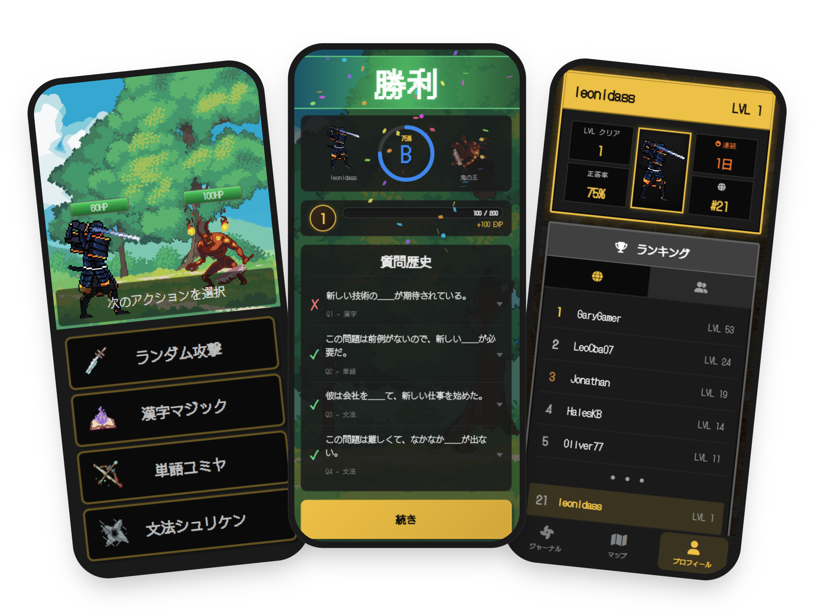

# Hi — I'm Leo 👋

**Full Stack Developer**&emsp;|&emsp;💼 Open to junior Full-stack / Frontend roles&emsp;|&emsp;🇦🇷 Córdoba, Argentina

I validate ideas, design MVPs, and build full-stack apps — from concept to production.  
🌏 Native Spanish, fluent English & Japanese, conversational Portuguese — from years in multicultural teams in Japan.

Graduated from [Le Wagon Tokyo AI Software Development Bootcamp](https://www.lewagon.com/tokyo).  
Currently continuing a Computer Programming degree at [Universidad Tecnológica Nacional](https://www.utn.edu.ar/).

🌱 Building AgroSaaS — a farm-management app for agricultural producers, built alongside a senior developer, with a local farmer as product owner driving real-world testing and go-to-market (in progress)

🌐 [leandrotrabucco.me](https://leandrotrabucco.me)  
🔗 [linkedin.com/in/leandro-trabucco](https://www.linkedin.com/in/leandro-trabucco/)  
✉️ [leandrotrabucco@gmail.com](mailto:leandrotrabucco@gmail.com)

---

## 🛠️ Tech Stack

**Languages:**&nbsp;     
**Frontend & Mobile:**&nbsp;       
**Backend & Data:**&nbsp;     
**Tooling:**&nbsp;    
**Learning:**&nbsp; 

---

## 🚀 Projects

### [El Alto](https://github.com/LeoCba07/el-alto-website)

Modern cabin rental website with a smart contact form and chatbot for a 30-year-old family business in Argentina. The contact form and chatbot pre-fill WhatsApp with dates and guest count — built to cut down an 80% incomplete-inquiry rate and streamline direct bookings.

**Stack:** Next.js, TypeScript, Tailwind CSS, Sanity CMS, Vercel, Google Analytics 4  
**Live:** [www.complejoelalto.com.ar](https://www.complejoelalto.com.ar)

 
 

### [Jidou Navi](https://www.jidou-navi.app)

A crowdsourced mobile app for discovering Japan's unique vending machines, with an interactive map and gamified check-ins. Sole developer since early 2026 (started with a partner) — owning frontend, backend, and mobile deployment. 🔒 Currently in closed testing on Google Play — public launch is the next step (iOS TBD).

**Stack:** React Native, Expo, TypeScript, Supabase (PostgreSQL/PostGIS), Mapbox  
**Join the waitlist:** [www.jidou-navi.app](https://www.jidou-navi.app)

 
 

### [Nihongo Hero](https://github.com/LeoCba07/Nihongo-Hero)

Gamified Japanese learning through RPG-style turn-based combat — answer questions to defeat enemies. Led a 4-person team for the final Le Wagon project: owned database architecture, API integrations, and code reviews as top contributor. Deployed as a mobile-first PWA.

**Stack:** Rails 7, JavaScript, Hotwire (Turbo + Stimulus), PostgreSQL, VoiceVox TTS API  
**Live:** [www.nihongohero.quest](https://www.nihongohero.quest)

 
 

### [Adventure Maker](https://github.com/LeoCba07/AdventureMaker)

AI-powered interactive storytelling with branching narratives and psychological assessment based on your choices. Built prompt engineering for dynamic story generation and Gemini image generation, solving narrative consistency across multiple free-form user input.

**Stack:** Rails 7, PostgreSQL, SCSS, Bootstrap, Google Gemini API  
**Live:** [adventuremaker.herokuapp.com](https://adventuremaker-shinowfu-91409f739c06.herokuapp.com/)

 
 

---

## ⚡ A bit more about me

🏋️‍♂️ Heavy weights enthusiast — 5x per week  
🎮 Almost became an e-sports athlete  
🍸 Four years in Tokyo's hospitality industry before code

---

Last updated: 2026-06-21
