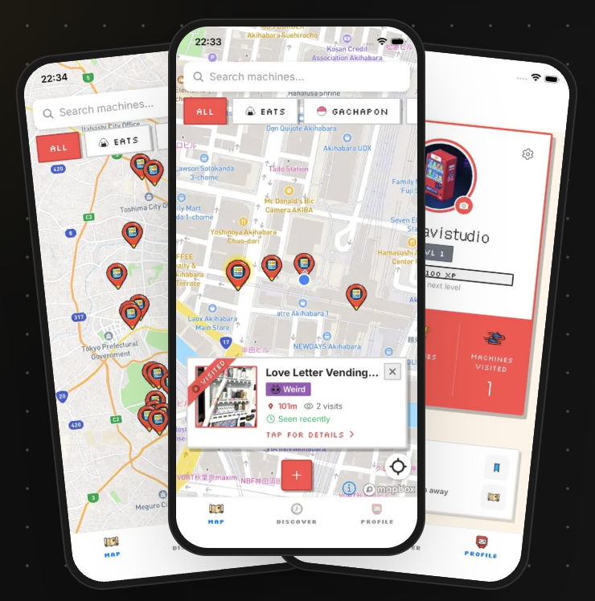
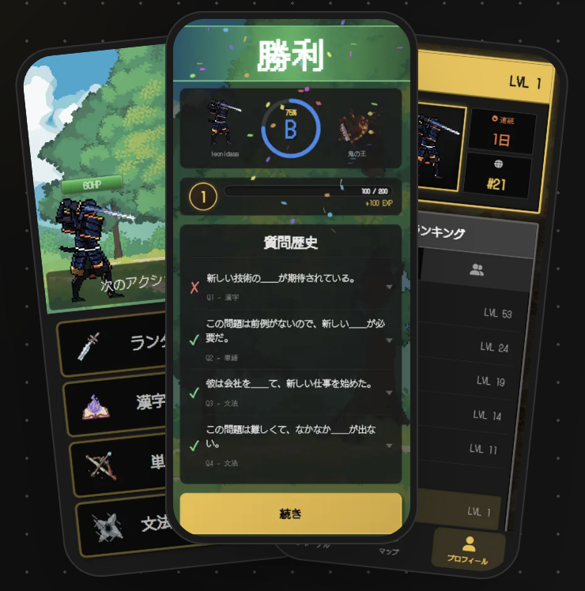
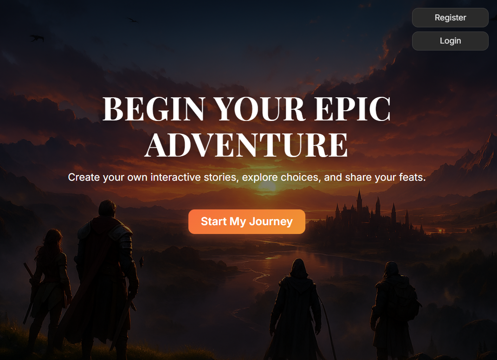

# Hi — I'm Leo 👋

**Full Stack Developer**      |      💼 Open to junior full-stack / frontend roles      |      🇦🇷 Córdoba, Argentina

I validate ideas, design MVPs, and build full-stack apps — from concept to production.  
🌏 Native Spanish, fluent English & Japanese and conversational Portuguese from years in multicultural teams in Japan.

Graduated from [Le Wagon Tokyo AI Software Development Bootcamp](https://www.lewagon.com/tokyo).  
Currently continuing a Computer Programming degree at [Universidad Tecnológica Nacional](https://www.utn.edu.ar/) — remotely from  

🌱 Building AgroSaaS — a farm-management app for agricultural producers alongside a senior developer, with a local farmer as product owner driving real-world testing and go-to-market (in progress)

🌐 [leandrotrabucco.me](https://leandrotrabucco.me)  
🔗 [linkedin.com/in/leandro-trabucco](https://www.linkedin.com/in/leandro-trabucco/)  
✉️ [leandrotrabucco@gmail.com](mailto:leandrotrabucco@gmail.com)

---

## 🛠️ Tech Stack

**Languages:**&nbsp;    
**Frontend & Mobile:**&nbsp;       
**Backend & Data:**&nbsp;     
**Tooling:**&nbsp;  

---

## 🚀 Projects

<table>
  <tr>
    <td width="42%">
      
    </td>
    <td valign="top">
      <h3><a href="https://github.com/LeoCba07/el-alto-website">El Alto</a></h3>
      
Modern cabin rental website with a smart contact form and chatbot for a 30-year-old family business in Argentina. The contact form and chatbot pre-fill WhatsApp with dates and guest count — built to cut down an 80% incomplete-inquiry rate and streamline direct bookings.

      
<b>Stack:</b> Next.js, TypeScript, Tailwind CSS, Sanity CMS, Google Analytics 4 
      <b>Live:</b> <a href="https://www.complejoelalto.com.ar">www.complejoelalto.com.ar</a>

    </td>
  </tr>
</table>

<table>
  <tr>
    <td valign="top">
      <h3>Jidou Navi</h3>
      
A crowdsourced discovery app for Japan's unique vending machines — co-built with a development partner, covering design, backend, API, and mobile deployment. 🔒 Currently in closed testing on Google Play — public launch is the next step (iOS TBD).

      
<b>Stack:</b> React Native, Expo, TypeScript, Supabase (PostgreSQL/PostGIS), Mapbox 
      <b>Join the waitlist:</b> <a href="https://www.jidou-navi.app">www.jidou-navi.app</a>

    </td>
    <td width="42%">
      
    </td>
  </tr>
</table>

<table>
  <tr>
    <td width="42%">
      
    </td>
    <td valign="top">
      <h3><a href="https://github.com/LeoCba07/Nihongo-Hero">Nihongo Hero</a></h3>
      
Gamified Japanese learning through RPG-style turn-based combat — answer questions to defeat enemies. Led a 4-person team for the final Le Wagon project: owned database architecture, API integrations, and code reviews as top contributor. Deployed as a mobile-first PWA.

      
<b>Stack:</b> Rails 7, JavaScript/Stimulus, PostgreSQL, Hotwire, VoiceVox TTS API 
      <b>Live:</b> <a href="https://www.nihongohero.quest">www.nihongohero.quest</a>

    </td>
  </tr>
</table>

<table>
  <tr>
    <td valign="top">
      <h3><a href="https://github.com/LeoCba07/AdventureMaker">Adventure Maker</a></h3>
      
AI-powered interactive storytelling with branching narratives and psychological assessment based on your choices. Built prompt engineering for dynamic story generation and Gemini image generation, solving narrative consistency across free-form user input.

      
<b>Stack:</b> Rails 7, PostgreSQL, Google Gemini API 
      <b>Live:</b> <a href="https://adventuremaker-shinowfu-91409f739c06.herokuapp.com/">adventuremaker.herokuapp.com</a>

    </td>
    <td width="42%">
      
    </td>
  </tr>
</table>

---

## ⚡ A bit more about me

🏋️‍♂️ Heavy weights enthusiast - 5x per week  
🎮 Almost became an e-sports athlete

---

Last updated: 2026-06-02
